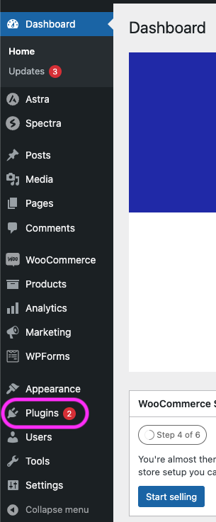
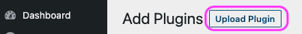
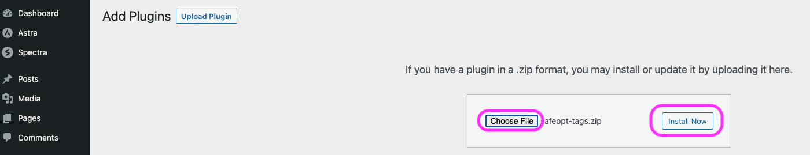
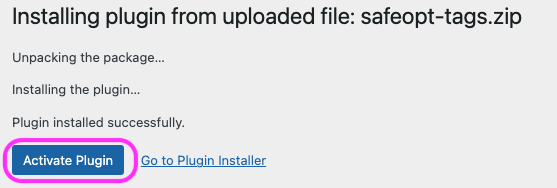
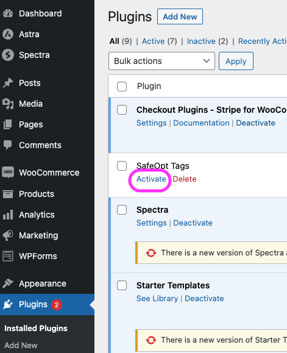
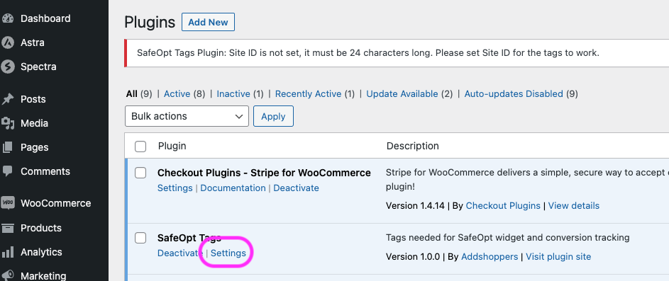
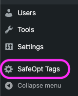
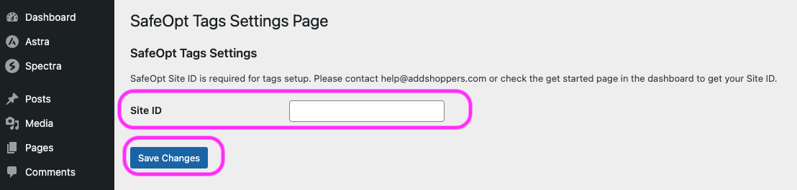
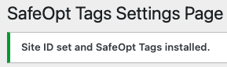

# SafeOpt Tags Plugin
## WordPress Plugin for WooCommerse

### Information
- plugin name: safeopt-tags
- works with: WordPress sites with WooCommerce
- install method: upload zip file
- version: 1.0.0
- developer: (Addshoppers)[https://www.addshoppers.com/]
- contact: [help@addshoppers.com](mailto:help@addshoppers.com)

---

### Description
This is a WordPress plugin that installs the SafeOpt Global Site Tag and Conversion Tracking Tag on your site.  

**NOTE: This works with WooCommerce Only, please contact [help@addshoppers.com](mailto:help@addshoppers.com) if you need support for other e-commerce platform.**

---

### Install Steps

1. download the [zip file](safeopt-tags.zip)

2. Go to the WordPress Admin for your site

3. Go to the Plugins Page

4. Click Add New 

5. Click Upload Plugin

6. Click choose file and select the downloaded zip file

7. Click Install Now

8. Click Activate or Click on Plugins page (same as step #3) ad click Activate

9. Click on settings from Plugins page or from Safeopt Tags settings page from the right menu bar

10. Enter a valid Site ID and click save changes.  **NOTE: Site ID will be provided to you by your contact at SafeOpt.**

11. Wait for the success message

12. Visit your site and in console check if `AddshoppersWidget` object is present
